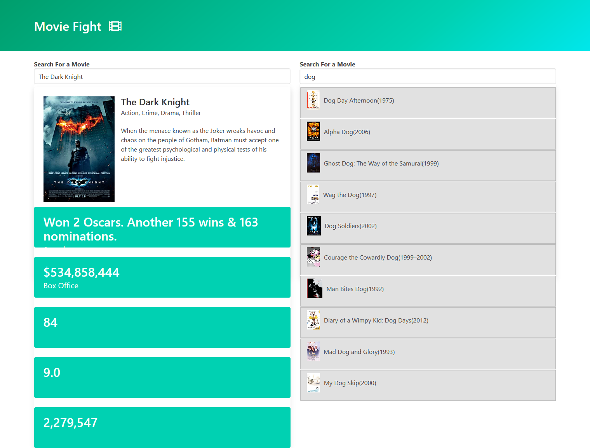
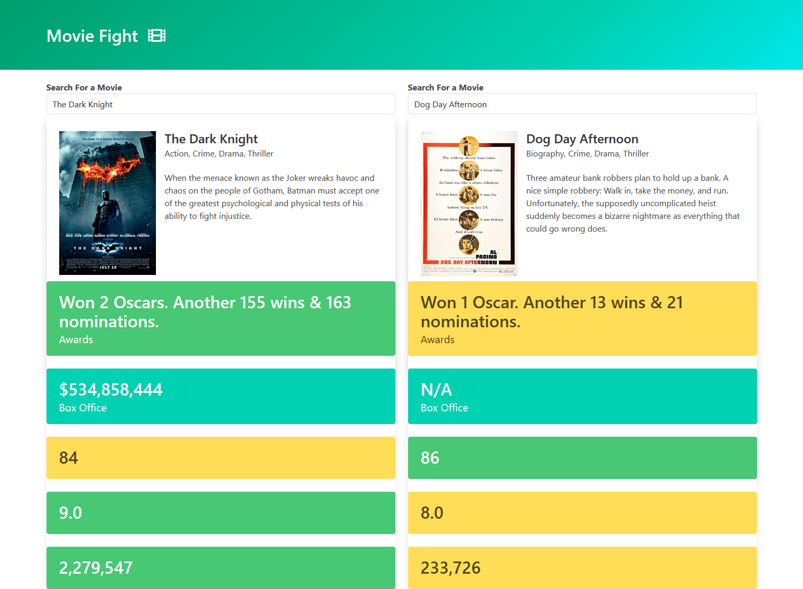

<!-- ABOUT THE PROJECT -->
## About The Project
This project allows user to search movies by name and compare two movies by their awards, box office numbers, imdb rating etc...
The users input is used to fetch data from an api. Data is then inserted into the DOM and compared once two movies are selected.

### Main Focus
* Build reusable widget for autocomplete
* Use axios to fetch data from api
* Handle async events

### Built With

* HTML/CSS
* Bulma
* Javascript

